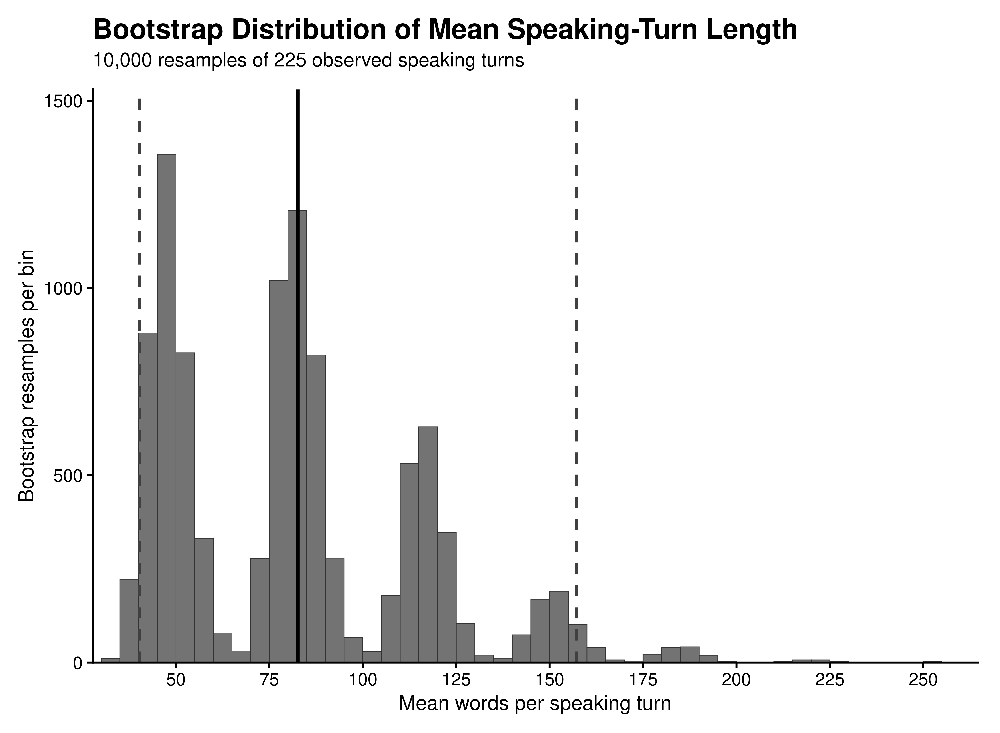

# Bootstrap Analysis of Speaking Turns in *Jules v. Andre Balazs Properties*

**Harsh Torane**  
2026

## Abstract

This study examines the oral argument transcript in *Jules v. Andre Balazs Properties*, No. 25-83, before the Supreme Court of the United States. The transcript was programmatically cleaned and divided into 225 speaking turns involving 11 identified speakers. Two transcript-level measures were examined: mean words per speaking turn and the percentage of turns containing a question. A nonparametric bootstrap procedure generated 10,000 resamples of the 225 observed speaking turns. The observed mean speaking-turn length was 82.54 words, while 32.00% of turns contained a question. Across the bootstrap resamples, the mean estimated speaking-turn length was 81.69 words (SD = 33.96; 95% interval = 40.19–157.22), while the mean estimated percentage of question-containing turns was 31.91% (SD = 3.07; 95% interval = 25.78–38.22%). The results demonstrate the reproducibility and sampling variability of these simple transcript-level measures.

## 1. Introduction

Oral arguments before the Supreme Court consist of a sequence of exchanges between Justices and attorneys. Basic characteristics of these exchanges, such as speaking-turn length and the frequency with which turns contain questions, can be measured directly from an official transcript.

This study provides a small reproducible analysis of the oral argument in *Jules v. Andre Balazs Properties*. The purpose is not to predict judicial decisions or model hypothetical oral arguments. Instead, the study asks a narrower question: how stable are two simple transcript-level statistics when the observed speaking turns are repeatedly resampled?

## 2. Data and Method

The analysis uses the official Supreme Court oral-argument transcript for *Jules v. Andre Balazs Properties*, No. 25-83, argued March 30, 2026. The transcript was processed in R using `pdftools`, `stringr`, `dplyr`, `ggplot2`, and `readr`.

The extraction procedure identified actual Justices and attorneys, reconstructed multi-line speaking turns, and removed common PDF and transcript artifacts. The final dataset contained 225 speaking turns, 11 speakers, and no remaining identified transcript artifacts.

Two measures were calculated for each speaking turn:

- Number of words in the turn.
- Whether the turn contained a question mark (`?`).

The observed transcript was then bootstrapped 10,000 times. Each resample consisted of 225 speaking turns sampled with replacement from the observed 225 turns. The two statistics were recalculated for every resample. The analysis used `set.seed(20260808)` for reproducibility.

## 3. Results

The observed transcript contained 225 speaking turns. The mean speaking-turn length was 82.54 words, while the median was 22 words. A total of 72 turns (32.00%) contained a question mark.

The bootstrap results were:

| Measure | Observed | Bootstrap Mean | SD | 95% Interval |
|:--|--:|--:|--:|--:|
| Mean words per speaking turn | 82.54 | 81.69 | 33.96 | 40.19–157.22 |
| Question-containing turns (%) | 32.00% | 31.91% | 3.07 | 25.78–38.22% |

The bootstrap means were close to the corresponding observed values. The distribution of mean speaking-turn length was considerably wider than the distribution of question-containing turns, reflecting the substantial variation in the lengths of individual speaking turns.

## 4. Discussion

The results show that the two observed transcript measures are reproduced closely on average when the speaking turns are resampled. The observed question-containing rate of 32.00% is particularly close to the bootstrap mean of 31.91%.

Speaking-turn length shows substantially greater variability. Although the observed mean was 82.54 words, the bootstrap distribution was wide, reflecting the presence of both short and very long turns. The median of 22 words further illustrates the skew created by longer speaking turns.

These results should be interpreted narrowly. The bootstrap does not create 10,000 hypothetical Supreme Court oral arguments. It resamples the 225 observed speaking turns to examine the sampling variability of the calculated statistics. The analysis therefore describes uncertainty around these transcript-level measures rather than making claims about Supreme Court arguments generally.

## 5. Conclusion

A simple, reproducible bootstrap analysis of the *Jules v. Andre Balazs Properties* oral argument produced stable estimates for question frequency while showing greater variability in speaking-turn length. The analysis demonstrates how publicly available Supreme Court transcripts can be converted into structured data and examined using a straightforward statistical procedure.

## Data and Reproducibility

All analysis code and generated results are available in the accompanying GitHub repository:

https://github.com/toraneh/jules-balazs-oral-argument-bootstrap

The official case materials are available from the Supreme Court of the United States, including the official docket and oral-argument transcript.

The analysis was run using R 4.5.0 and Poppler 25.03.0.